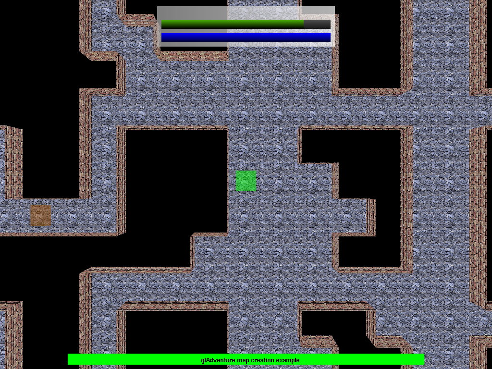

# gl-adventure

A ugly C dungeon exploration game :

# Dependencies

	opengl
	glut
	x11

# Building

This project uses `cmake` :

	mkdir build
	cd build/
	cmake ..
	make
	./gladventure

# Command-line options

	-f, --fullscreen  Set the game in fullscreen mode.  (not working yet)
	-h, --help                  Show available command-line options and exit. 
	-m, --monster [arg]         Test the monster named [arg] in a random map. 

# In-game controls

	Arrows        Move player
	I             Inventory dialog
	C             Character dialog
	Esc           Exit
	Enter         Collect item
	Page up/down  Zoom in/out
	D             Log debug  (only in Debug mode)
	L             Log player (only in Debug mode)
